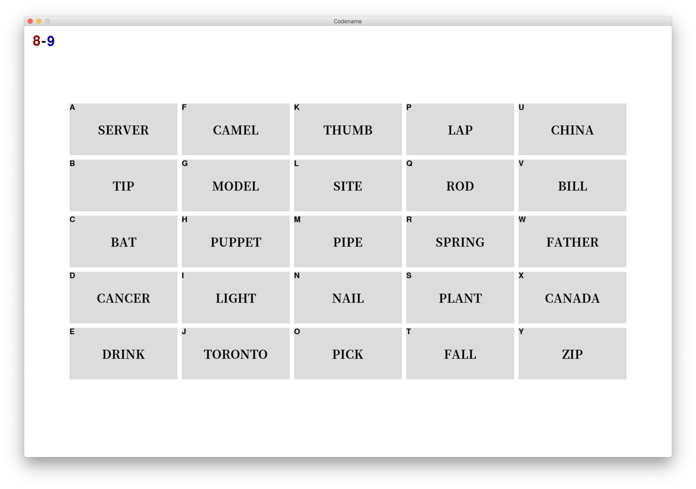
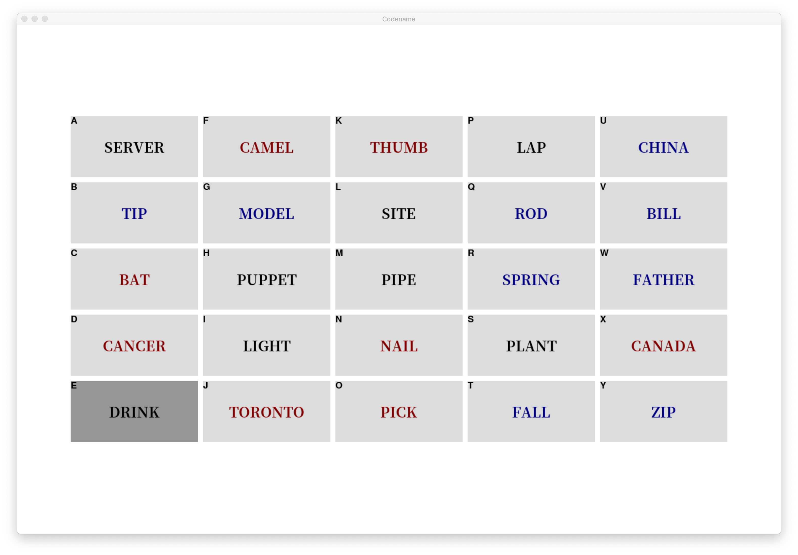

# CodeName-Python

## Game overview



## Requirements

To run the code, you need to download every listed package in [requirements.txt](requirements.txt)

## Installation

- Clone this repository

```shell
mkdir Games
cd Games
mkdir fonts
```
- Download fonts: 
* go to https://fonts.google.com/specimen/Noto+Serif+SC
* download NotoSerifSC-Bold.otf / NotoSerifSC-Regular.otf files
* put them in the fonts folder
* go to https://fonts.google.com/specimen/Ma+Shan+Zheng
* download MaShanZheng-Regular.ttf
* put it in the fonts folder
- Go to the Games folder and enter following command
```shell
git clone https://github.com/oooolga/CodeName-Python
```

## How to play?

- Open two terminal windows on two different monitors (monitor-A and monitor-B)
- In Terminal A, run the line "python3 server.py".
- While Terminal A is waiting for a client, run the line "python3 client.py" in Terminal B to connect.
- Follow the instruction on the screen to load vocabulary list.
- Pick team members (two teams: red/blue)
- When a team guesses a word, press the letter corresponding to that word on keyboard.
- Play! Have fun!
- Rules can be found [here](https://czechgames.com/files/rules/codenames-rules-en.pdf).

## Customize vocabulary list
- go to folder VocabList
- add a new vocabulary text file or modify an existing one